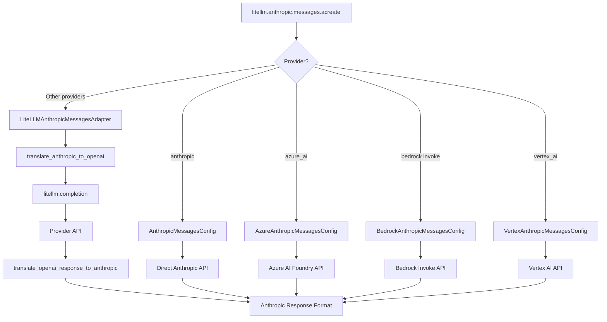
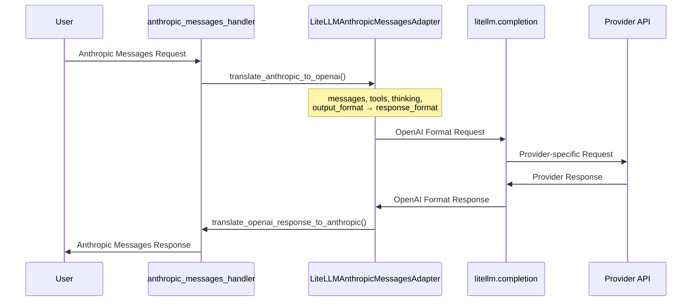

# Anthropic Messages Pass-Through Architecture

## Request Flow

## Adapter Flow (Non-Native Providers)

## Shared Anthropic SSE emission (Chat + Responses)

## AAWM provider route preparation

AAWM's OpenAI-compatible Anthropic pass-through routes use provider-owned
preparation modules under `providers/<provider>/adapter.py`. These modules own
the preparation that has been extracted for their routes: provider-specific
ordering of request transforms, policy application, credential/target
preparation, and construction of the immutable route plan. `providers/common.py`
owns the shared Anthropic-to-Responses translation, prompt-cache/reasoning
metadata, completion preparation, and config-selected tool/parallel policy
sequencing used by those modules.

The proxy route module injects runtime callbacks for FastAPI request access,
credential stores, target URL helpers, egress validation, and transport
operations. Provider algorithms are not implemented in
`llm_passthrough_endpoints.py`: the route module keeps thin compatibility
wrappers and runtime assembly so existing private imports and monkeypatch-based
tests continue to observe the same call sites.

Google's larger shaping surface is split by responsibility across
`providers/google/` modules for content selection and compaction, schema and
prompt policy, Anthropic replay, tool pairing and aliasing, request assembly and
preparation, response translation and streaming, persisted-output compaction,
and error shaping. `providers/google/shaping.py` is a compatibility facade that
re-exports those provider-owned functions and binds route-layer runtime
dependencies into the implementation modules. Its checked-in `shaping.pyi`
records the static callable contract for type checkers; it is not a second
implementation.

The same ownership rule applies to Grok normalization and composer repair,
OpenCode Zen normalization, and OpenRouter error/retry transport. The god-file
may delegate through the historical private function names, but ownership tests
require the substantive function bodies to live under
`experimental_pass_through/providers/`.

There are two parallel adapter trees that reconstruct Anthropic `/v1/messages`
SSE for non-native backends:

| Tree | Upstream shape | Streaming wrapper |
|---|---|---|
| `adapters/` | OpenAI Chat Completions chunks | `adapters/streaming_iterator.py` (`AnthropicStreamWrapper`) |
| `responses_adapters/` | OpenAI Responses API events | `responses_adapters/streaming_iterator.py` (`AnthropicResponsesStreamWrapper`) |

**Input normalization stays tree-local** (Chat chunk → normalized delta vs
Responses event → normalized delta). **Anthropic-side event envelopes and SSE
framing are shared** so Chat and Responses cannot drift on
`content_block_*` / `message_*` shapes:

- Shared helpers live in `adapters/streaming_iterator.py`:
  - `emit_message_start`
  - `emit_content_block_start`
  - `emit_content_block_delta`
  - `emit_content_block_stop`
  - `emit_message_delta`
  - `emit_message_stop`
  - `encode_anthropic_sse_chunk`
- `responses_adapters/streaming_iterator.py` imports those helpers and must not
  hand-build `{"type": "content_block_delta", ...}` (or sibling) envelopes, and
  must frame SSE via `encode_anthropic_sse_chunk` in
  `async_anthropic_sse_wrapper()`.

### Stable `prompt_cache_key` (shared observability helper)

When Anthropic-shaped requests are relayed to OpenAI backends, outbound
`prompt_cache_key` is derived by
`adapters/observability.derive_prompt_cache_key()`. It hashes **stable**
`system` + `tools` material only (including `cache_control` breakpoints under
those roots). Per-turn / moving `cache_control` on user/assistant message
blocks is intentionally excluded so multi-turn Claude Code traffic reuses the
same server-side prompt-cache key across turns.

Neither streaming iterator reimplements cache hashing; request-path adapters
call the shared helper.

## Gemini route debug (`AAWM_GEMINI_ROUTE_DEBUG`)

When `AAWM_GEMINI_ROUTE_DEBUG=1`, the Chat stream wrapper dumps per-chunk
Gemini raw/translated diagnostics. The flag is resolved once in
`AnthropicStreamWrapper.__init__` (not per chunk) and is logged via
`verbose_logger.debug` so production WARNING-level pipelines and alerting stay
quiet. This is intentional debug tracing, not a warning condition.

## Responses streaming event map (summary)

| Responses API event | Anthropic SSE event(s) |
|---|---|
| `response.created` | `message_start` |
| `response.output_item.added` (message / function_call / reasoning / mcp_call) | `content_block_start` |
| `response.output_text.delta` | `content_block_delta` (`text_delta`) |
| `response.reasoning_summary_text.delta` | `content_block_delta` (`thinking_delta`) |
| `response.function_call_arguments.delta` / `.done` | `content_block_delta` (`input_json_delta`; empty deltas skipped) |
| `response.output_item.done` | `content_block_stop` (+ late `input_json_delta` if needed) |
| `response.completed` | `message_delta` + `message_stop` |
