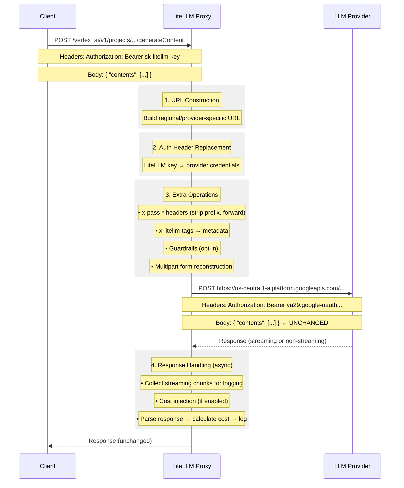

# Pass-Through Endpoints Architecture

## Why Pass-Through Endpoints Transform Requests

Even "pass-through" endpoints must perform essential transformations. The request **body** passes through unchanged, but:

## Essential Transformations

- **URL Construction** - Build correct provider URL (e.g., regional endpoints for Vertex AI, Bedrock)
- **Auth Header Replacement** - Swap LiteLLM virtual key for actual provider credentials

## Extra Operations

| Operation | Description |
|-----------|-------------|
| `x-pass-*` headers | Strip prefix and forward (e.g., `x-pass-anthropic-beta` → `anthropic-beta`) |
| `x-litellm-tags` header | Extract tags and add to request metadata for logging |
| Streaming chunk collection | Collect chunks async for logging after stream completes |
| Multipart form handling | Reconstruct multipart/form-data requests for file uploads |
| Guardrails (opt-in) | Run content filtering when explicitly configured |
| Cost injection | Inject cost into streaming chunks when `include_cost_in_streaming_usage` enabled |

## What Does NOT Change

- Request body
- Response body
- Provider-specific parameters

## AAWM shared pass-through request engine (RR-056)

`pass_through_endpoints.py` is the shared HTTP/WebSocket pass-through core used
by provider routes. Operator-facing behaviors that are easy to miss:

### Hidden pre-first-byte retries (issue #1)

- Pre-first-byte upstream 5xx/429/timeout/connect failures may be retried with
  fixed backoff inside a single inbound request.
- Total wall-clock budget is bounded by
  `AAWM_PASSTHROUGH_HIDDEN_RETRY_BUDGET_SECONDS` (default = sum of backoff
  schedule, currently 230s). Set `0` to disable the wall-clock bound while
  keeping the attempt-count ceiling.
- This is independent of the per-attempt HTTP client timeout.

### xAI failure capture (issue #2)

- Direct `_direct_capture_xai_passthrough_failure` is a **fallback only**.
- When `AawmAgentIdentity` is already registered on `litellm.callbacks` /
  `failure_callback`, the direct path is skipped to avoid double
  session_history / failure bookkeeping.

### Provider failure classifiers (issue #3)

- Known vendor failure kinds live under
  `provider_failure_classifiers/` (per-provider modules + `registry.py`).
- The shared request engine imports
  `_run_passthrough_provider_failure_classifiers` from that package and runs a
  registry-style dispatch; new vendor quirks register in the package rather
  than growing the god-module exception path.

### WebSocket message buffer (issue #4)

- Upstream WS messages retained for success-handler cost/logging use a bounded
  ring buffer (`_WEBSOCKET_PASSTHROUGH_MESSAGE_BUFFER_MAX`, default 256).
- Long-lived realtime sessions (e.g. Vertex Live) must not grow unbounded.

### Failure-hook transformation (issue #5)

- `post_call_failure_hook` return values that are real `BaseException` instances
  are applied on the pass-through failure path (same contract as
  `common_request_processing` / auth exception handling).

### Non-stream SSE detection (issue #6)

- Non-GET "non-stream" sends use `stream=True` so content-type can be inspected
  before full-body buffering; true SSE hands off to the streaming handler.
- Non-SSE bodies (success and error) are drained with `aread()`.

### Tool-schema normalization gate (issue #9)

- OpenAI function-tool `type: object` `properties` fixes run only for
  OpenAI-like targets (provider/endpoint/host gate), not for every pass-through.

### Route registry lookup (issue #10)

- Registered pass-through routes maintain exact/subpath path indexes for
  per-request lookup; `is_registered_pass_through_route` reuses
  `get_registered_pass_through_route`.

### Agent-identity import (issue #7 / RR-003)

- Direct xAI capture uses a single canonical import:
  `litellm.integrations.aawm_agent_identity.aawm_agent_identity_instance`.
- RR-003 packaging force-includes that module into the published
  `aawm_litellm_callbacks.agent_identity` wheel surface; the checkout wheel
  loader re-exports the same module. No dual runtime probe remains.
- Callback *registration* markers still recognize either package path so
  configs that list the wheel dotted name continue to skip double-capture.

### Inline imports (issue #8)

- Non-circular helpers (`all_litellm_params`, `get_end_user_id_from_request_body`,
  `persist_agent_terminal_error`) are module-scoped.
- `proxy_logging_obj` / `Logging` remain function-local because `proxy_server`
  imports this module at startup.

### Chat-completion body parse (issue #11)

- `chat_completion_pass_through_endpoint` parses bodies with `json.loads` only
  (no `ast.literal_eval` first attempt).

## AAWM Claude control-plane (fork overlay)

`aawm_claude_control_plane.py` owns Claude Code request rewrites and dynamic
injection for this fork. Operator-facing behavior that is easy to miss:

### Trust boundary

- Explicit AAWM HTML/`@@@` directives may appear anywhere in `system` /
  `messages`.
- `:#name.ctx#:` markers and SubagentStart dispatch backtick/acronym grabs run
  only on trusted surfaces: `system` and the first user message. Later tool /
  web / assistant text cannot trigger same-tenant content-store lookups.

### Lookup fan-out budget (RR-053)

Dispatch backtick/acronym expansion is intentionally bounded:

- **Per text node:** at most `_AAWM_DISPATCH_CONTEXT_REFERENCE_MAX` (24)
  distinct references.
- **Per request:** at most `_AAWM_DISPATCH_CONTEXT_REFERENCE_REQUEST_MAX` (48)
  distinct lookups across *all* trusted text blocks, with request-wide
  deduplication of names already resolved earlier in the walk.
- Common all-caps noise tokens (`SQL`, `JSON`, `API`, ...) are stopworded.
- Pool acquire uses a finite timeout
  (`AAWM_DYNAMIC_INJECTION_ACQUIRE_TIMEOUT_SECONDS`, default 10s).

Per-node caps alone are not enough: system + first-user content can contain many
blocks; the request-wide budget is what stops unbounded DB fan-out.

### Connection pool lifecycle

The control-plane module owns the canonical process-wide asyncpg pool used for
dynamic injection / context grabs **and** for sibling AAWM Postgres lookups that
share the same DSN (for example OpenRouter free-tier durable quota reads in
`llm_passthrough_endpoints.py`). `close_aawm_dynamic_injection_pool()` is
invoked from `proxy_shutdown_event()` so connections are released on clean
proxy shutdown.

`llm_passthrough_endpoints` re-exports the control-plane pool/DSN helpers
(`_get_aawm_dynamic_injection_pool`, `_build_aawm_dynamic_injection_dsn`, …)
for stable import compatibility, but it must not create a second asyncpg pool.

### Control-plane rewrite scope

`apply_claude_control_plane_rewrites_to_anthropic_request_body()` rewrites only
`system` and the first user message (auto-memory, prompt-patch manifest,
CommonMark identifier list). Full history is not re-scanned every turn.

## AAWM alias routing and adapter ownership (RR-054)

`llm_passthrough_endpoints.py` retains FastAPI route registration and thin
compatibility wrappers, plus runtime assembly. Provider preparation and
provider algorithms, along with shared policy, state, I/O, shaping, retry
sequencing, stream validation, and response finalization, are package-owned:

| Concern | Owner |
|--------|--------|
| Candidate tables, aliases, model allowlists, cooldown defaults | `aawm_alias_routing/policy.py` |
| Cooldown, affinity, OAuth, lane-cache, and candidate probe-lock state | `aawm_alias_routing/state.py` |
| Durable Redis keys, max-expiry writes, negative reads, DualCache coherency | `aawm_alias_routing/durable.py` |
| Alias-routing Redis connection, DualCache attachment, self-heal, write-retry policy, readiness status | `litellm/proxy/aawm_alias_routing_redis.py` |
| Google and Antigravity OAuth file/token I/O | `aawm_alias_routing/google_oauth.py`, `aawm_alias_routing/antigravity_oauth.py` |
| Config-driven nine-route execution plans | `aawm_alias_routing/adapter_config.py`, `aawm_alias_routing/adapter_driver.py` |
| Shared Anthropic-to-Responses/completion shaping orchestration | `litellm/llms/anthropic/experimental_pass_through/providers/common.py` |
| Provider request shaping, credential/target preparation order, and route-plan construction | `litellm/llms/anthropic/experimental_pass_through/providers/<provider>/adapter.py` |
| Google/Antigravity provider preparation and Google process-local project/prime cache algorithms | `providers/google/adapter.py`, `providers/google/process_cache.py`, `providers/antigravity/adapter.py` |
| Grok argument/input normalization and composer response repair | `providers/grok/normalization.py`, `providers/grok/composer_repair.py` |
| OpenCode Zen request and stream normalization | `providers/opencode_zen/normalization.py` |
| OpenRouter retry and transport algorithms | `providers/openrouter/retry_transport.py` |
| Cross-provider text/JSON shaping primitives | `aawm_alias_routing/provider_shaping.py` |
| Bounded, lossless stream peeking | `aawm_alias_routing/streaming.py` |
| Responses-to-Anthropic finalization | `aawm_alias_routing/responses_finalize.py` |
| Shared retry attempt sequencing and cooldown waits | `aawm_alias_routing/retry.py` |
| Structured task-state source selection | `aawm_alias_routing/task_state.py` |
| Route registration, process-local routing call sites, compatibility re-exports, and residual provider orchestration | `llm_passthrough_endpoints.py` |

The legacy `aawm_alias_routing_policy.py` module is a compatibility facade over
`aawm_alias_routing/policy.py`; it does not redeclare candidate tables or
policy constants. `aawm_alias_routing_policy.pyi` supplies its static public
contract. Google follows the same pattern: `providers/google/shaping.py`
re-exports functions owned by focused implementation modules and
`providers/google/shaping.pyi` supplies the type-checking contract. The facade
modules preserve import and monkeypatch compatibility without creating a second
policy or shaping owner.

The nine Anthropic adapter route entrypoints delegate provider preparation to
the corresponding `providers/<provider>/adapter.py` module, then delegate
execution to the shared package drivers. The provider modules own transform
ordering, provider policy application, credential/target preparation, and
route-plan construction. `llm_passthrough_endpoints.py` injects route-layer
services through immutable runtime contracts so it retains FastAPI request
objects, environment/credential access points, egress validation, and transport
callbacks. The provider algorithm extraction is complete; the god-file still
owns the integration call sites and runtime assembly for these modules, including
Google/Antigravity cache-lifecycle callbacks, provider normalization/repair
invocation, request/stream handoff, transport callbacks, route-layer error
mapping, and final response delivery. Those callbacks do not move substantive
provider algorithms back into the route module. Responses finalization is
configured with explicit runtime callbacks so that control flow is
package-owned without importing the FastAPI route module.

Google retry classification retains separate capacity, rate-limit, transient,
and request budgets through strategy callbacks. The shared retry driver owns
only identical attempt sequencing; it does not collapse Google's multi-budget
semantics into OpenRouter policy.

### Runtime invariants

- Durable Redis keys use
  `aawm:alias-routing:{namespace}:{family}:{kind}:{sha256_hex(state_key)}`.
  Writes preserve the greatest existing `expires_at_epoch`, floor Redis TTL at
  one second, write Redis with propagated errors first, and then perform
  best-effort DualCache write-through. Affinity writes also pass a bounded
  process-local cardinality gate before creating another durable key.
- DualCache selection prefers the dedicated alias-routing manager. When that
  Redis target is configured but unavailable, routing falls back to local state
  rather than writing alias-routing keys into the shared usage cache.
- Google tool-call reconstruction always threads a stable request/session scope
  through remember and lookup chains.
- Candidate provider probes are single-flight per alias family and cooldown key;
  waiters re-check cooldown state before opening another provider call.
- Candidate stream validation buffers only within explicit chunk/byte limits.
  Overflow returns the buffered prefix, overflow chunk, and lazy tail in order;
  it never drains or truncates the remaining upstream stream.
- System-reminder parsing uses linear delimiter spans or a cheap closer guard,
  including unmatched-opener paths.
- Terminal audit context (host, repository, client, dispatch, trace, session,
  prior tool activity) is memoized on `request.state`.
