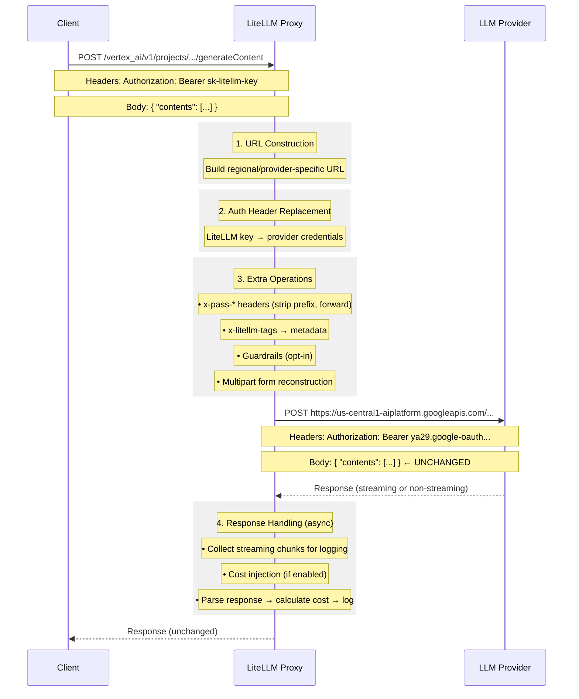

# Pass-Through Endpoints Architecture

## Why Pass-Through Endpoints Transform Requests

Even "pass-through" endpoints must perform essential transformations. The request **body** passes through unchanged, but:

## Essential Transformations

- **URL Construction** - Build correct provider URL (e.g., regional endpoints for Vertex AI, Bedrock)
- **Auth Header Replacement** - Swap LiteLLM virtual key for actual provider credentials

## Extra Operations

| Operation | Description |
|-----------|-------------|
| `x-pass-*` headers | Strip prefix and forward (e.g., `x-pass-anthropic-beta` → `anthropic-beta`) |
| `x-litellm-tags` header | Extract tags and add to request metadata for logging |
| Streaming chunk collection | Collect chunks async for logging after stream completes |
| Multipart form handling | Reconstruct multipart/form-data requests for file uploads |
| Guardrails (opt-in) | Run content filtering when explicitly configured |
| Cost injection | Inject cost into streaming chunks when `include_cost_in_streaming_usage` enabled |

## What Does NOT Change

- Request body
- Response body
- Provider-specific parameters## AAWM shared pass-through request engine (RR-056)

`pass_through_endpoints.py` is the shared HTTP/WebSocket pass-through core used
by provider routes. Operator-facing behaviors that are easy to miss:

### Hidden pre-first-byte retries (issue #1)

- Pre-first-byte upstream 5xx/429/timeout/connect failures may be retried with
  fixed backoff inside a single inbound request.
- Total wall-clock budget is bounded by
  `AAWM_PASSTHROUGH_HIDDEN_RETRY_BUDGET_SECONDS` (default = sum of backoff
  schedule, currently 230s). Set `0` to disable the wall-clock bound while
  keeping the attempt-count ceiling.
- This is independent of the per-attempt HTTP client timeout.

### xAI failure capture (issue #2)

- Direct `_direct_capture_xai_passthrough_failure` is a **fallback only**.
- When `AawmAgentIdentity` is already registered on `litellm.callbacks` /
  `failure_callback`, the direct path is skipped to avoid double
  session_history / failure bookkeeping.

### Provider failure classifiers (issue #3)

- Known vendor failure kinds live under
  `provider_failure_classifiers/` (per-provider modules + `registry.py`).
- The shared request engine imports
  `_run_passthrough_provider_failure_classifiers` from that package and runs a
  registry-style dispatch; new vendor quirks register in the package rather
  than growing the god-module exception path.

### WebSocket message buffer (issue #4)

- Upstream WS messages retained for success-handler cost/logging use a bounded
  ring buffer (`_WEBSOCKET_PASSTHROUGH_MESSAGE_BUFFER_MAX`, default 256).
- Long-lived realtime sessions (e.g. Vertex Live) must not grow unbounded.

### Failure-hook transformation (issue #5)

- `post_call_failure_hook` return values that are real `BaseException` instances
  are applied on the pass-through failure path (same contract as
  `common_request_processing` / auth exception handling).

### Non-stream SSE detection (issue #6)

- Non-GET "non-stream" sends use `stream=True` so content-type can be inspected
  before full-body buffering; true SSE hands off to the streaming handler.
- Non-SSE bodies (success and error) are drained with `aread()`.

### Tool-schema normalization gate (issue #9)

- OpenAI function-tool `type: object` `properties` fixes run only for
  OpenAI-like targets (provider/endpoint/host gate), not for every pass-through.

### Route registry lookup (issue #10)

- Registered pass-through routes maintain exact/subpath path indexes for
  per-request lookup; `is_registered_pass_through_route` reuses
  `get_registered_pass_through_route`.

### Agent-identity import (issue #7 / RR-003)

- Direct xAI capture uses a single canonical import:
  `litellm.integrations.aawm_agent_identity.aawm_agent_identity_instance`.
- RR-003 packaging force-includes that module into the published
  `aawm_litellm_callbacks.agent_identity` wheel surface; the checkout wheel
  loader re-exports the same module. No dual runtime probe remains.
- Callback *registration* markers still recognize either package path so
  configs that list the wheel dotted name continue to skip double-capture.

### Inline imports (issue #8)

- Non-circular helpers (`all_litellm_params`, `get_end_user_id_from_request_body`,
  `persist_agent_terminal_error`) are module-scoped.
- `proxy_logging_obj` / `Logging` remain function-local because `proxy_server`
  imports this module at startup.

### Chat-completion body parse (issue #11)

- `chat_completion_pass_through_endpoint` parses bodies with `json.loads` only
  (no `ast.literal_eval` first attempt).
